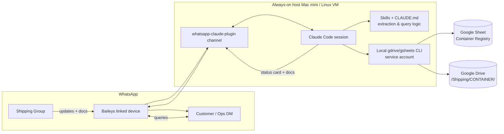

# Shipping Container Assistant — Complete Build Plan

A WhatsApp-driven, Claude-powered assistant for freight/shipping operations.

**What it does, in one line:** shipping updates and documents dropped into a
WhatsApp group are automatically parsed by Claude, written to a Google Sheet,
and filed into Google Drive — and anyone on an allowlist can text a WhatsApp
number to get a container's status and pull its reference documents on demand.

---

## 0. Read this first — the one important correction

You described this as a **"Claude Project"** using the
[`rich627/whatsapp-claude-plugin`](https://github.com/rich627/whatsapp-claude-plugin)
MCP connector. After reviewing that repo, the architecture is different from a
claude.ai *Project*, and it matters:

- `whatsapp-claude-plugin` is a **Claude Code plugin / "channel"**, not a
  claude.ai Projects connector. It runs **Baileys** (the WhatsApp Web protocol)
  as a **linked device** on a machine you control, and it **wakes a running
  Claude Code session** whenever a WhatsApp message arrives.
- That means the system is **an always-on Claude Code agent running on a host
  you keep online 24/7** — not a hosted Project that magically polls WhatsApp.
- A claude.ai Project *cannot* autonomously receive WhatsApp messages. So we
  build this on **Claude Code + the channel plugin**, which is exactly what the
  connector is designed for.

Everything below is designed around that reality.

### Tools the connector actually gives us

From the plugin's README, Claude gets these MCP tools:

| Tool | Use in this system |
|---|---|
| `list_groups` | Discover/confirm the shipping group's chat ID |
| `catch_up` | Replay messages missed while the session was down (idempotent re-ingest) |
| `unreplied` | Find customer queries not yet answered |
| `download_attachment` | Pull PDFs/photos/voice notes off a message |
| `reply` | Send status cards and documents back (auto-chunks, can attach files) |
| `react` | ✅ a message to confirm ingestion without spamming the group |
| `edit_message` | Correct a previously sent reply |
| `status` | Health check the WhatsApp link |

It also supports **per-group config**, **allowlists**, **emoji-based permission
relay**, **voice-note transcription** (via `mlx-whisper`, Apple Silicon only),
and **cron tasks** — all of which we use below.

---

## 1. High-level architecture



**Two flows share one agent:**

1. **Ingest flow** — group message ⟶ parse ⟶ Drive upload + Sheet upsert ⟶ ✅.
2. **Query flow** — DM ⟶ look up Sheet ⟶ reply with status ⟶ (on request) fetch
   doc from Drive and send it back.

---

## 2. Components & prerequisites

| # | Component | Choice / recommendation | Notes |
|---|---|---|---|
| 1 | **Always-on host** | **Mac mini (Apple Silicon)** recommended; Linux VM acceptable | Mac unlocks local voice-note transcription (`mlx-whisper`). Must stay powered + online 24/7. |
| 2 | **Runtime** | **Bun** + **Claude Code** + the plugin | Per the plugin's install steps. |
| 3 | **WhatsApp number** | A **dedicated business SIM/number** with WhatsApp installed | Baileys links to a *real* WhatsApp account as a companion device. Do **not** use a personal number. |
| 4 | **Anthropic API** | Claude Code with an API key / subscription | Model routing in §8 to control cost. |
| 5 | **Google Cloud project** | **Service account** with Sheets API + Drive API enabled | Server-to-server, no interactive OAuth. Share the Sheet + Drive folder with the service-account email. |
| 6 | **Google Sheet** | "Container Registry" workbook (schema in §4) | The structured source of truth. |
| 7 | **Google Drive folder** | `/Shipping/` root, one subfolder per container | Document store. |
| 8 | **Local glue CLI** | Small `shipctl` tool (Bun/Node or Python) the skill calls | Deterministic Sheet/Drive I/O — see §6. |

> **Optional synergy:** this same repo already ships the **MediaVault / wa-dl**
> browser extension for bulk-downloading WhatsApp media. It can serve as a
> manual backup/export path for the group's media, independent of the agent.
> Not required for this system, but worth keeping in mind for archival.

---

## 3. Ingestion flow (group → data)

When a message lands in the shipping group, the channel wakes Claude, which runs
the **`container-ingest`** skill:

1. **Read** the message text (+ transcribe voice notes if present).
2. **Extract** structured fields (schema §4) using the skill's rules:
   - Detect **container numbers** with the ISO 6346 pattern **and check-digit
     validation** (§7) — reject false positives.
   - Detect **B/L**, **booking**, **vessel/voyage**, **ports (POL/POD)**,
     **ETD/ETA**, **status keywords** (gated-in, loaded, sailed, discharged,
     gate-out, empty-returned), **seal**, **weight**, **free-time/demurrage**.
3. **Download attachments** (`download_attachment`) and **classify** each
   (Bill of Lading, commercial invoice, packing list, delivery order, photo,
   customs doc, other).
4. **Upload to Drive**: ensure `/Shipping/<CONTAINER>/` exists, upload the file
   with a normalized name (`<CONTAINER>_<DOCTYPE>_<yyyymmdd>.<ext>`), capture the
   shareable link.
5. **Upsert the Sheet**: update the row for that container (or insert a new one),
   set `Last update`, append the doc link to the container's doc list; **append
   the raw event** to an append-only `Events` tab for audit.
6. **Confirm** with a `react` ✅ on the source message (quiet — no chatty replies
   in the group unless configured).
7. **Edge cases:**
   - *No valid container number found* → write to a **`Review` tab** for a human,
     do **not** guess.
   - *Multiple containers in one message* → one row/upsert each; file the doc
     under each (or a shared `/Shipping/<BL>/` if BL-level).
   - *Duplicate message* (same message id already ingested) → skip (idempotent).
   - *Ambiguous status* → store verbatim text in `Notes`, leave `Status` blank.

**Design principle:** ingestion is **append-safe and idempotent**. Re-running
`catch_up` after downtime must never double-write — dedupe on WhatsApp message id
(stored in the `Events` tab).

---

## 4. Data model

### Sheet: `Containers` (one row per container — current state)

| Column | Example | Source |
|---|---|---|
| `Container No` | `MSKU1234567` | extracted (validated) |
| `Size/Type` | `40HC` | extracted |
| `B/L No` | `MAEU123456789` | extracted |
| `Booking No` | `BK0099123` | extracted |
| `Shipper` | `ABC Traders` | extracted |
| `Consignee` | `XYZ Imports` | extracted |
| `POL` (load port) | `Karachi (PKKHI)` | extracted |
| `POD` (disch port) | `Jebel Ali (AEJEA)` | extracted |
| `Vessel / Voyage` | `MSC ISABELLA / 245W` | extracted |
| `ETD` | `2026-07-10` | extracted |
| `ETA` | `2026-07-24` | extracted |
| `Status` | `Sailed` | extracted (controlled vocab) |
| `Seal No` | `SL889231` | extracted |
| `Cargo` | `Cotton yarn, 20 plt` | extracted |
| `Gross Wt` | `21,400 kg` | extracted |
| `Free time / Demurrage` | `7 days, LFD 2026-07-31` | extracted |
| `Docs` | `BL ↗ · Invoice ↗ · PL ↗` | Drive links |
| `Drive Folder` | `/Shipping/MSKU1234567/ ↗` | Drive |
| `Notes` | free text | extracted |
| `Last Update` | `2026-07-19 14:03` | system |
| `Updated By` | WhatsApp sender name | system |
| `First Seen` | `2026-07-11` | system |

**Status controlled vocabulary:** `Booked → Gated-In → Loaded → Sailed → In
Transit → Transshipment → Arrived → Discharged → Gated-Out → Delivered → Empty
Returned` (+ `Hold`, `Exception`).

### Sheet: `Events` (append-only audit log)

`Timestamp · WA Message ID · Sender · Group · Raw text · Container(s) · Extracted
JSON · Attachments · Drive links · Ingest status`

### Sheet: `Review` (needs a human)

Messages where extraction failed or was ambiguous, with the reason.

### Drive layout

```
/Shipping/
  MSKU1234567/
    MSKU1234567_BL_20260711.pdf
    MSKU1234567_INVOICE_20260711.pdf
    MSKU1234567_PHOTO_20260719.jpg
  HLXU7654321/
    ...
  _review/          # docs we couldn't attribute to a container
```

---

## 5. Query flow (DM → answer)

A person DMs the business number (or @-mentions the bot in an allowed group):

1. **Intent parse** — "status of MSKU1234567", "where's my Hapag booking 123",
   "eta for the Jebel Ali box", "send me the BL for MSKU1234567".
2. **Lookup** — resolve the container via the `Containers` sheet (by container
   no / BL / booking; fuzzy match on shipper+POD if needed).
3. **Reply** with a compact **status card**:
   ```
   📦 MSKU1234567 (40HC) — SAILED
   BL MAEU123456789 · Booking BK0099123
   MSC ISABELLA / 245W
   Karachi → Jebel Ali · ETA 24 Jul 2026
   Free time: 7 days (LFD 31 Jul)
   Docs on file: BL, Invoice, Packing List
   Reply "docs" for files.
   ```
4. **Document retrieval on request** — "send BL" / "docs" → `shipctl` downloads
   the file(s) from Drive to a temp path, and `reply` attaches them.
5. **Not found** → offer the closest matches or ask for the BL/booking number.

**Guardrails:**
- Only **allowlisted** numbers get data (plugin allowlist + our own check).
- **Document access can be scoped** so a customer only pulls *their own*
  shipments (match sender ↔ consignee/shipper) — configurable per §9.
- Never dump the whole sheet; answer one container at a time.

---

## 6. The glue: `shipctl` (local Sheet/Drive CLI)

Rather than have Claude click through a Google MCP interactively, give it a
**small, deterministic CLI** it calls via Bash. This is more testable, cheaper,
and idempotent. (A Google Sheets/Drive MCP server is a valid alternative if you'd
rather not maintain a CLI — the skill logic is identical either way.)

Proposed interface (implement in Bun or Python with a **service account**):

```
shipctl upsert-container --json '<container fields>'      # insert/update by Container No
shipctl append-event --json '<event record>'             # audit log (idempotent on msg id)
shipctl get-container <CONTAINER|BL|BOOKING>              # returns JSON for query flow
shipctl ensure-folder <CONTAINER>                         # -> Drive folder id + link
shipctl upload <CONTAINER> <localfile> --doctype BL       # -> shareable link
shipctl fetch-doc <CONTAINER> [--doctype BL]              # download to temp for reply
shipctl add-review --json '<why + raw>'                   # push to Review tab
```

Auth: `GOOGLE_APPLICATION_CREDENTIALS=/path/service-account.json`; the Sheet and
`/Shipping/` folder are **shared with the service-account email** (least
privilege — only those two resources).

---

## 7. Container number validation (ISO 6346)

Container numbers are `4 letters + 6 digits + 1 check digit` (e.g.
`MSKU 123456 7`). The 7th digit is a checksum — validating it kills most false
positives (phone numbers, invoice numbers, etc.).

Algorithm the skill/`shipctl` enforces:

1. Map each of the 4 letters to a value (A=10, B=12, C=13 … skipping multiples of
   11; standard ISO 6346 table).
2. Multiply letter+digit values by `2^position` (position 0–9).
3. Sum, take `mod 11`; if result is `10` it maps to `0`.
4. That must equal the printed 7th digit.

Regex to *find* candidates: `\b[A-Z]{4}\d{7}\b` (owner code + serial + check),
then run the checksum before trusting it.

---

## 8. Cost, models & reliability

**Cost control — model routing:**
- **Ingestion / extraction** (high volume, structured) → route to **Haiku 4.5**
  or **Sonnet 5**; extraction is a cheap, well-specified task.
- **Query answering** (customer-facing, occasional nuance) → **Sonnet 5**, escalate
  to **Opus 4.8** only for genuinely ambiguous requests.
- Every inbound group message triggers an agent turn, so a busy group ⇒ real
  token spend. Budget by estimating messages/day × avg tokens; set a ceiling and
  alert.

**Reliability:**
- Keep the session alive with **`launchd` (macOS)** or **`systemd`/`pm2`
  (Linux)** auto-restart.
- On restart, run **`catch_up`** so nothing dropped during downtime is lost
  (idempotent thanks to msg-id dedupe).
- Handle Anthropic + Google **rate limits** with backoff in `shipctl`.
- **Back up the Sheet** (scheduled export) and keep the `Events` tab as the
  replayable source of truth.
- Monitor with the plugin's `status` + a daily cron self-check that DMs you if
  the link is down.

---

## 9. Security, privacy & compliance

- **Baileys = unofficial WhatsApp automation.** WhatsApp's ToS can flag/ban
  automated linked devices. Mitigations: dedicated number, human-like reply
  pacing, no spam. **For production scale, plan a migration path to the official
  WhatsApp Business Cloud API** (webhook-based) — same data model, different
  transport. Treat the Baileys build as the fast pilot.
- **Allowlist everything.** Use the plugin's per-group policy + allowlist so only
  known numbers can query or trigger the bot.
- **Least-privilege Google access** — service account can touch *only* the one
  Sheet and the `/Shipping/` folder.
- **Data minimization / PII** — commercial docs contain trade data; restrict
  Drive sharing, don't make links public (use per-request downloads, not
  "anyone with link"), and scope customer doc access to their own shipments.
- **Secrets** live in the host env / `~/.whatsapp-channel/`, never in the repo.
  The repo's `.gitignore` must cover service-account JSON and channel state.
- **Audit** — the `Events` tab records who sent what and when.

---

## 10. Phased roadmap (with acceptance criteria)

| Phase | Goal | Done when… |
|---|---|---|
| **0 — Decisions & accounts** | Lock the open decisions (§11); provision number, Google Cloud service account, host | Host online; number linkable; service-account JSON in place |
| **1 — Stand up the channel** | Install Bun + Claude Code + plugin; pair the number; `list_groups`; confirm messages wake the session | A test group message wakes Claude and `catch_up` replays it |
| **2 — Data plumbing** | Build `shipctl`; create Sheet (3 tabs) + `/Shipping/`; test upsert/upload/fetch manually | `shipctl` round-trips a fake container + doc to Sheet & Drive |
| **3 — Ingestion skill** | `container-ingest` skill live on the group, reactions-only, `Review` tab for misses | 20 real messages ingest correctly; no double-writes on `catch_up` |
| **4 — Query bot** | `container-query` skill for DM lookups + doc retrieval, behind allowlist | Allowlisted DM gets an accurate status card + BL on request |
| **5 — Hardening** | Validation, dedupe, monitoring, cost caps, backups; draft Cloud API migration | Runs a week unattended; daily health DM; Sheet backups verified |

**Skills to author** (live on the host, in `~/.claude/skills/` or the plugin's
config): `container-ingest`, `container-query`, plus a shared **CLAUDE.md** that
pins the schema, the status vocabulary, the ISO 6346 rules, and the reply format.

---

## 11. Open decisions I need from you

1. **Host:** Mac mini (enables voice-note transcription) vs Linux VM (cheaper,
   no local Whisper)?
2. **Transport now vs later:** OK to pilot on the unofficial Baileys plugin and
   plan a later move to the official WhatsApp Business Cloud API — or go official
   from day one (more setup, no ban risk)?
3. **Data backend:** Google Sheets + Drive as specified (recommended for your
   ask), or would you rather Airtable / a real DB for scale?
4. **Who can query?** Internal ops team only, or also customers (which adds the
   per-customer document-scoping work in §5/§9)?
5. **`shipctl` vs Google MCP:** build the small local CLI (recommended) or wire a
   community Google Sheets/Drive MCP server?
6. **Fields:** does the §4 schema match your operation, or do you track other
   fields (e.g., customs entry no, transporter, delivery address, PO number)?

---

## 12. What I can do next

- Scaffold `shipctl` (service-account Sheets/Drive CLI) with tests.
- Write the `container-ingest` and `container-query` skills + `CLAUDE.md`.
- Provide the exact plugin install/pairing runbook and a `systemd`/`launchd`
  keep-alive unit.
- Create the Google Sheet template (3 tabs, headers, validation) as a spec.

Tell me your answers to §11 and I'll start with whichever phase you want.
